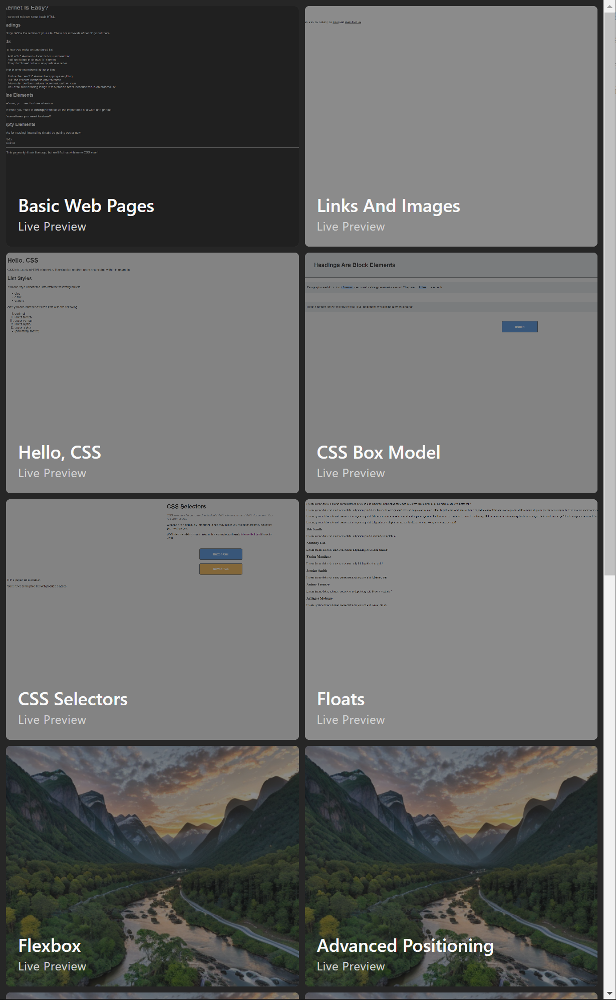
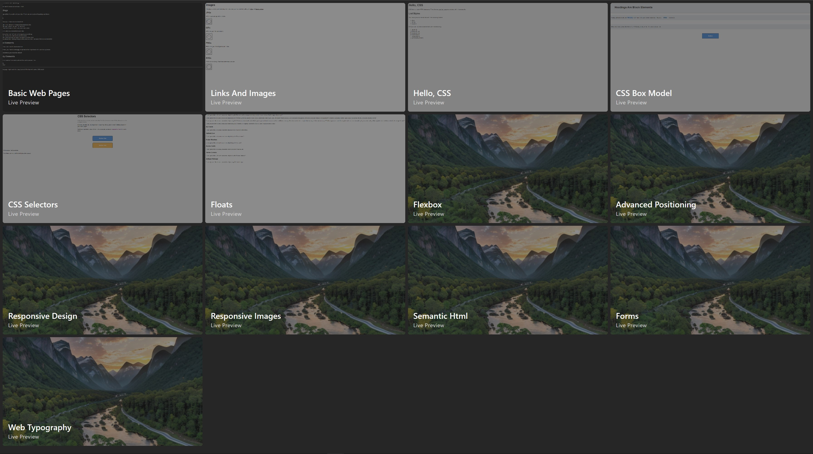

 

  

<h1 align="center">Internet Is Hard Web Development Course Archive</h1>

## Table of contents

- [Table of contents](#table-of-contents)
- [About](#about)
- [Tutorials](#tutorials)
- [Screenshots](#screenshots)
- [Built with](#built-with)
- [Links](#links)
- [License](#license)

## About

This is an archive repository with all of the pages I have created during my web development course by <a href="https://internetingishard.netlify.app/html-and-css/index.html">Internet Is Hard</a>

## Tutorials

- Introduction
- Basic web pages
- Links and images
- Hello, CSS
- The box model
- CSS selectors
- Floats
- Flexbox
- Advanced positioning
- Responsive design
- Responsive images
- Semantic HTML
- Forms
- Web typography

## Screenshots

## Built with

## Links

- [Live Preview](https://seesmof.github.io/internet-is-hard-web-course/)
- [Course URL](https://internetingishard.netlify.app/html-and-css/index.html)

## License

This project is licensed under the [MIT License](./LICENSE).

<a href="#readme-top"><strong>Back to top</strong></a>

